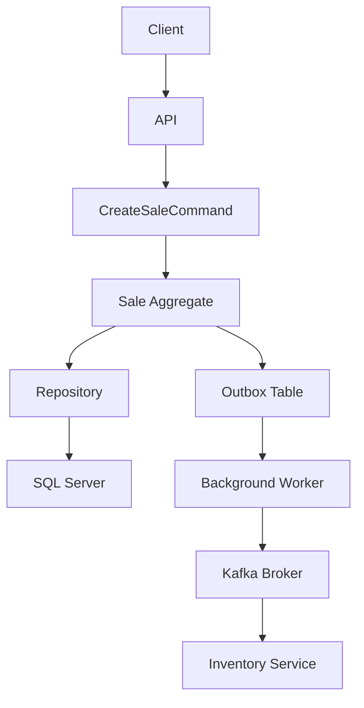
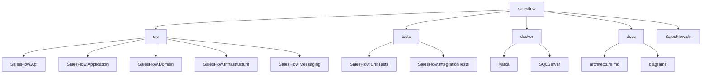
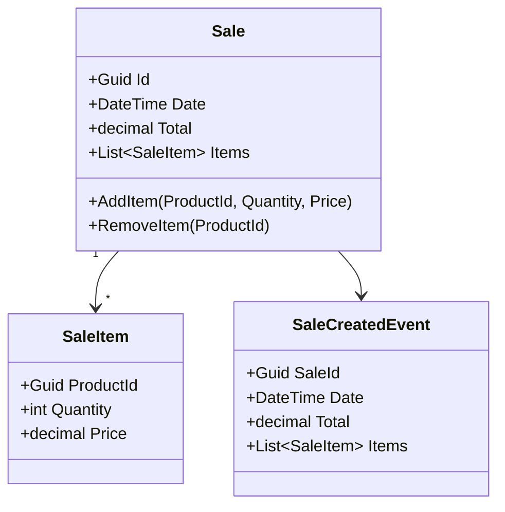

# SalesFlow

[](https://dotnet.microsoft.com/)

[](https://kafka.apache.org/)

[](https://www.microsoft.com/sql-server)

[](https://docker.com/)


SalesFlow é um **sistema de vendas orientado a eventos**, projetado para demonstrar arquitetura backend moderna baseada em **DDD, Clean Architecture e mensageria com Kafka**.

O objetivo do projeto é simular um fluxo real de vendas onde **operações de domínio geram eventos que são publicados e consumidos por outros serviços**.

Esse tipo de arquitetura é comum em **sistemas de e-commerce, ERPs e plataformas de pagamento**.

---

# Principais características

* Arquitetura baseada em **DDD (Domain Driven Design)**
* **Clean Architecture**
* Comunicação **Event-Driven**
* Mensageria com **Apache Kafka**
* Persistência com **SQL Server**
* **Outbox Pattern** para consistência entre banco e eventos
* **TDD (Test Driven Development)**
* Containers com **Docker**

---

# Tecnologias utilizadas

| Tecnologia            | Função               |
| --------------------- | -------------------- |
| .NET 8                | Plataforma principal |
| ASP.NET Core          | API REST             |
| Entity Framework Core | ORM                  |
| SQL Server            | Banco de dados       |
| Apache Kafka          | Event streaming      |
| Docker                | Containers           |
| xUnit                 | Testes               |
| FluentAssertions      | Assertiva de testes  |
| TestContainers        | Testes de integração |

---

# Arquitetura

O projeto segue **Clean Architecture** combinada com **Domain Driven Design**.

Camadas do sistema:

```
API
 ↓
Application
 ↓
Domain
 ↓
Infrastructure
```

Responsabilidades:

| Camada         | Responsabilidade                      |
| -------------- | ------------------------------------- |
| API            | Endpoints REST                        |
| Application    | Casos de uso da aplicação             |
| Domain         | Regras de negócio                     |
| Infrastructure | Banco de dados e integrações externas |

Regra de dependência:

```
Domain → não depende de ninguém
Application → depende do Domain
Infrastructure → depende de Application e Domain
API → depende de Application
```

---

# Estrutura do projeto

```
salesflow
│
├── src
│
│   ├── SalesFlow.Api
│   │
│   ├── SalesFlow.Application
│   │
│   ├── SalesFlow.Domain
│   │
│   ├── SalesFlow.Infrastructure
│   │
│   └── SalesFlow.Messaging
│
├── tests
│
│   ├── SalesFlow.UnitTests
│   │
│   └── SalesFlow.IntegrationTests
│
├── docker
│
│   ├── kafka
│   └── sqlserver
│
├── docs
│
└── SalesFlow.sln
```


# Arquitetura geral (Clean + DDD)

```mermaid
flowchart TD
    Client --> API[API (Presentation)]
    API --> App[Application (UseCases)]
    App --> Domain[Domain (Entities / Aggregates)]
    Domain --> Infra[Infrastructure (DB / Kafka)]
```

---

# Fluxo de venda (Event Driven)



---

## 3️⃣ Estrutura de diretórios



---

## 4️⃣ Aggregate Sale


---

# Domínio

O domínio inicial do sistema é composto por:

```
Product
Inventory
Sale
SaleItem
User
```

O **Aggregate Root principal** é:

```
Sale
```

Estrutura do aggregate:

```
Sale
 ├─ SaleItem
 └─ DomainEvent (SaleCreated)
```

Uma venda controla seus itens e é responsável por gerar eventos de domínio.

---

# Arquitetura orientada a eventos

Quando uma venda é criada:

```
API
 ↓
CreateSaleCommand
 ↓
Domain
 ↓
Persistência
 ↓
Domain Event
 ↓
Kafka
```

Evento publicado:

```
sales.created
```

Exemplo de payload:

```json
{
  "saleId": "guid",
  "date": "2026-03-07",
  "total": 1500,
  "items": [
    {
      "productId": "guid",
      "quantity": 2,
      "price": 750
    }
  ]
}
```

Outros serviços podem consumir esse evento para:

* atualizar estoque
* gerar faturamento
* atualizar analytics

---

# Outbox Pattern

Para evitar inconsistência entre banco e mensageria, o projeto utiliza **Outbox Pattern**.

Fluxo:

```
Transaction
 ↓
Persist Sale
 ↓
Salvar evento na tabela Outbox
 ↓
Worker publica no Kafka
```

Isso garante que **eventos nunca sejam perdidos**.

---

# Kafka

Configuração de brokers:

```
localhost:9094
localhost:9095
```

Bootstrap server:

```
localhost:9094,localhost:9095
```

Tópico principal:

```
sales.created
```

---

# Banco de dados

Banco utilizado:

```
SQL Server
```

Exemplo de connection string:

```
Server=localhost;
Database=SalesFlow;
User Id=sa;
Password=Your_password123;
TrustServerCertificate=true;
```

---

# Testes

O projeto segue **TDD**.

Fluxo de desenvolvimento:

```
1. Criar teste
2. Executar teste (falha)
3. Implementar código
4. Teste passa
5. Refatorar
```

Tipos de testes:

```
Unit Tests
Integration Tests
```

Ferramentas:

```
xUnit
FluentAssertions
TestContainers
```

---

# Como executar o projeto

### 1 Clonar repositório

```
git clone https://github.com/seu-usuario/salesflow
cd salesflow
```

---

### 2 Restaurar dependências

```
dotnet restore
```

---

### 3 Subir infraestrutura com Docker

```
docker compose up -d
```

Isso iniciará:

```
Kafka
SQL Server
```

---

### 4 Executar API

```
cd src/SalesFlow.Api
dotnet run
```

API disponível em:

```
http://localhost:5000
```

---

# Objetivo do projeto

Este projeto foi criado com foco em:

* estudo de **arquitetura backend moderna**
* aplicação prática de **DDD**
* integração com **mensageria**
* simulação de **sistemas distribuídos**
